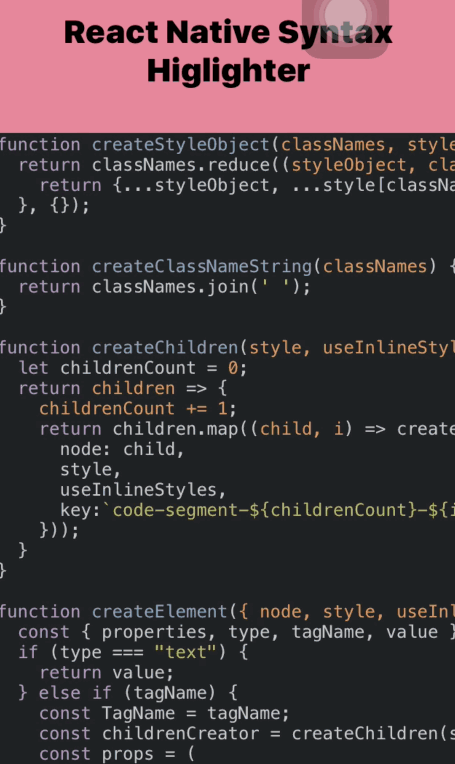

## React Native Syntax Highlighter


Syntax highlighting component for `React Native` using <a href='https://github.com/conorhastings/react-syntax-highlighter'> `react-syntax-highlighter`</a>

You can see a <a href="https://snack.expo.io/BypG26zdz">demo</a> using snack by <a href="https://expo.io">Expo</a>

Alternatively you can scan this qr code in The Expo app to access on your phone:


### With Highlight.js vdom


### With Prism vdom


You can try it out with <a href='https://expo.io'>Expo</a> <a href='https://expo.io/@conor/test-native-syntax'>here</a>

### Install

`npm install react-native-syntax-highlighter --save`


### Use

#### props
Accepts all of the same props as <a href='https://github.com/conorhastings/react-syntax-highlighter'> `react-syntax-highlighter`</a> with three additional props.
* `fontFamily` - the font family to use for syntax text.
* `fontSize` - the fontSize for syntax text.
* `highligter` - defaults to rendering with vdom created from highlightjs, but can pass in `prism` as alternate option. You can see more about dealing with the prism highlighter in the docs for <a href='https://github.com/conorhastings/react-syntax-highlighter'>react-syntax-highlighter</a> but one of the main uses would be better support for jsx

```js
import SyntaxHighlighter from 'react-native-syntax-highlighter';
/*by default component uses hljs so access hljs styles, import from /prism for prism styles */
import { docco } from 'react-syntax-highlighter/styles/hljs';
const Component = () => {
  const codeString = '(num) => num + 1';
  return <SyntaxHighlighter 
  	language='javascript' 
  	style={docco}
  	highlighter={"prism" || "hljs"}
  >
  	{codeString}
  </SyntaxHighlighter>;  
}
```

### Unsupported Props
Some of the react-syntax-highlighter props are not currently supported by the mobile version, you can see which listed below:

- useInlineStyles
- showLineNumbers
- startingLineNumber
- lineNumberContainerStyle
- lineNumberStyle

### Styles Available -- hljs 

* agate
* androidstudio
* arduinoLight
* arta
* ascetic
* atelierCaveDark
* atelierCaveLight
* atelierDuneDark
* atelierDuneLight
* atelierEstuaryDark
* atelierEstuaryLight
* atelierForestDark
* atelierForestLight
* atelierHeathDark
* atelierHeathLight
* atelierLakesideDark
* atelierLakesideLight
* atelierPlateauDark
* atelierPlateauLight
* atelierSavannaDark
* atelierSavannaLight
* atelierSeasideDark
* atelierSeasideLight
* atelierSulphurpoolDark
* atelierSulphurpoolLight
* atomOneDark
* atomOneLight
* brownPaper
* codepenEmbed
* colorBrewer
* darcula
* dark
* darkula
* defaultStyle
* docco
* dracula
* far
* foundation
* githubGist
* github
* googlecode
* grayscale
* gruvboxDark
* gruvboxLight
* hopscotch
* hybrid
* idea
* irBlack
* kimbieDark
* kimbieLight
* magula
* monoBlue
* monokaiSublime
* monokai
* obsidian
* ocean
* paraisoDark
* paraisoLight
* pojoaque
* purebasic
* qtcreatorDark
* qtcreatorLight
* railscasts
* rainbow
* routeros
* schoolBook
* solarizedDark
* solarizedLight
* sunburst
* tomorrowNightBlue
* tomorrowNightBright
* tomorrowNightEighties
* tomorrowNight
* tomorrow
* vs
* vs2015
* xcode
* xt256
* zenburn

### Styles Available -- prism

* coy
* dark
* funky
* okaidia
* solarizedlight
* tomorrow
* twilight
* prism
* atomDark
* base16AteliersulphurpoolLight
* cb
* darcula
* duotoneDark
* duotoneEarth
* duotoneForest
* duotoneLight
* duotoneSea
* duotoneSpace
* ghcolors
* hopscotch
* pojoaque
* vs
* xonokai 


